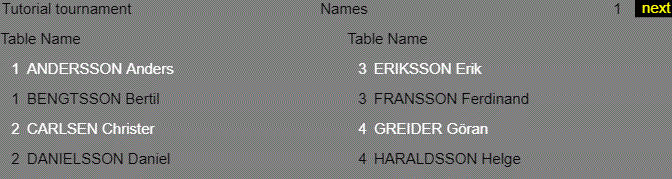
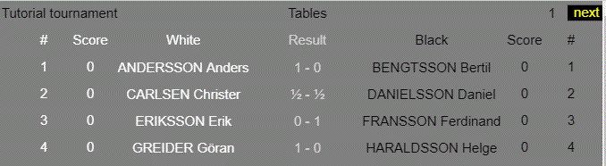
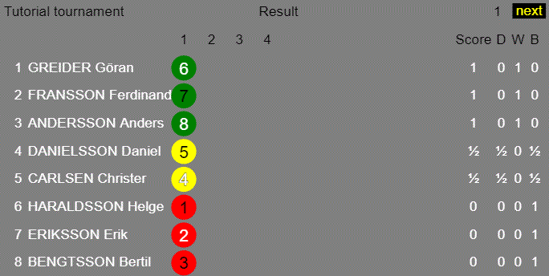

WORK IN PROGRESS!

[Try it!](https://christernilsson.github.io/2023/044-Monrad)

64 players:  
```
https://christernilsson.github.io/2023/044-Monrad
?T=Wasa_SK
&D=2023-11-28
&N=AA|AB|AC|AD|AE|AF|AG|AH|BA|BB|BC|BD|BE|BF|BG|BH|CA|CC|CC|CD|CE|CF|CG|CH|DA|DD|DC|DD|DE|DF|DG|DH|EA|EE|EC|ED|EE|EF|EG|EH|FA|FF|FC|FD|FE|FF|FG|FH|GA|GB|GC|GD|GE|GF|GG|GH|HA|HB|HC|HD|HE|HF|HG|HH
```
### Monrad

	* Handles tournaments with 4 to 64 players.

### Quick Start

Enter the names in the URL.  
Show the names and let everybody be seated.  
The names are alphabetically ordered.  



When the first game is played, click Next to see the Tables screen.  



Click on the winner or between them for a draw.  
Clicking twice cancels the result.  
When all results are entered, click Next.  



Click Next to start the next round.  

### Instructions
	Edit the URL above.  
	Add the names of the players.  

	* N contains then names, separated with |. Mandatory.
	* H contains the header of the tournament. Optional
	* D contains the Date. Optional
	* R contains the number of rounds. Optional
		* Default: minimum number of rounds if the tournament was a cup, plus 50%.
		* One round added to make the number of rounds even.
		* If you want a different number of rounds, just put it in the URL.
	* T contains the tiebreak order. Default: T=WD1
		* W = Number of Wins
		* D = Direct Encounter. Used only groups with exactly two players
		* 1 = Buchholz 1. The sum of all opponents
		* 2 = Buchholz 2. The sum of all opponents except the weakest.
		* B = Number of Black games
		* S = Sonneborn-Berger
		* F = Fide Tiebreak
	* Z states the team size. Default: Z=1. Maximum 8.

	The following parameters are internal and handled by the program:
	* O contains the opponents
	* C contains the colours, B & W
	* S contains the scores, 0, 1 or 2 for victory.

### Saving the tournament
	* The updated URL contains all information to display the result page.
	* The URL is available on the clipboard. Windows:ok, Apple:no (thanks to EU and GDPR)
	* No tournament will be stored on the server.

### Sample URL
Eight players, four rounds  
Just copy and paste it into your browser. Oneliner not needed.  
```
https://christernilsson.github.io/2023/044-Monrad
?N=CARLSEN_Christer|BENGTSSON_Bertil|HARALDSSON_Helge|ERIKSSON_Erik|ANDERSSON_Anders|DANIELSSON_Daniel|GREIDER_Göran|FRANSSON_Ferdinand
&H=Wasa SK KM blixt
&D=2023-11-25
&O=1356|0437|3765|2014|5173|4602|7520|6241
&C=WBWB|BWWB|WBWB|BWBW|WBWB|BWBW|WBBW|BWBW
&S=2111|0200|1222|1122|0020|2010|2201|0002
&T=WD1
```

# Table of number of rounds (R) given number of players (N).
General rule: 2*R <= N. Also R <= 20
```
N: 4 6 8 10 12 24 26 62 64
R: 2 3 4  4  6  6  8  8 10
```

### Teams

* State the team size in parameter Z
* Keys: 
	* 0
	* space ½
	* 1
	* q 1½
	* 2
	* w 2½ 
	* 3
	* e 3½
	* 4
	* r 4½
	* 5
	* t 5½
	* 6
	* y 6½
	* 7
	* u 7½
	* 8
	* Left  Arrow: Decrease White with ½. Wraps.
	* Right Arrow: Increase White with ½. Wraps.
* Use Up and Down to select game. Wraps
* Also: Home End PgUp PgDn
* Letters: Search the next Player starting with the letter.

# Kontroller av URL.
* Antal spelare skall överensstämma i N, O, C och R
* Antal ronder skall överensstämma i O C och R
* Tillåtna tecken i N: I princip alla möjliga. De kodas/avkodas automatiskt. T ex åäöÅÄÖéæýþÿüïœßđèùúøàáçìíñμ-. Emojis?
* Tillåtna tecken i O: 0123456789abcdefghijklmnopqrstuvwxyzABCDEFGHIJKLMNOPQRSTUVWXYZ-/ (64 tecken)
* Tillåtna tecken i C: BW (två tecken)
* Tillåtna tecken i R individuellt spel: 012 (tre tecken)
* Tillåtna tecken i R med åtta spelare per lag: 0123456789abcdefg (16 tecken)

### Begränsningar
* 4 till 64 spelare

### Noterat
Begränsningar i antal ronder med maxweight-algoritmen:
N 8 16 32 64 128
R 4 10 25 50 113
64/50 tar 1204 ms (python) för alla ronderna.
För stora N och små R är min rekursiva pair mycket snabbare.

### Frågor
* Ska man se till att antaler ronder alltid är jämnt ? (Av färgrättviseskäl)
* Vad är lämpligt antal ronder, givet N spelare ?
* Visa placering som 12 (plats, Jämn=Vit, Udda=Svart) eller 6W (bord + färg) ?

### ToDo

* Slumpa namnen om ORC saknas!
* Blankett att fylla i resultatet (bordslista). En för varje rond.
* E= (ELO-rating) förberedelse för Swiss
* TB= (Tiebreaks) Prioritetsordning
* P= (partier per match) Lagturneringar
* R= Antal ronder
* Ändra Result till Score
* Score anges med ett tecken. T ex åtta spelare: 0 1q2w3e4r5t6y7u8  q=½-7½  u=7½-½

### Transpilering av .py till .coffee.
Tvingades transpilera fyra funktioner i ett eget pass, pga begränsningar i chatGPT.  
Enda felaktigheten var att jag behövde byta `i,j = j,i` mot `[i,j] = [j,i]`